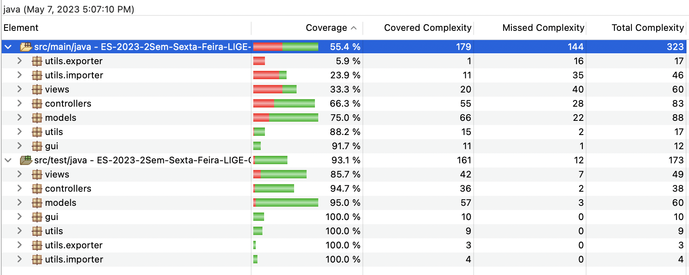
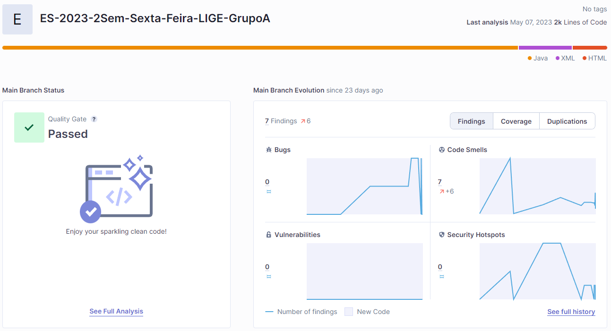
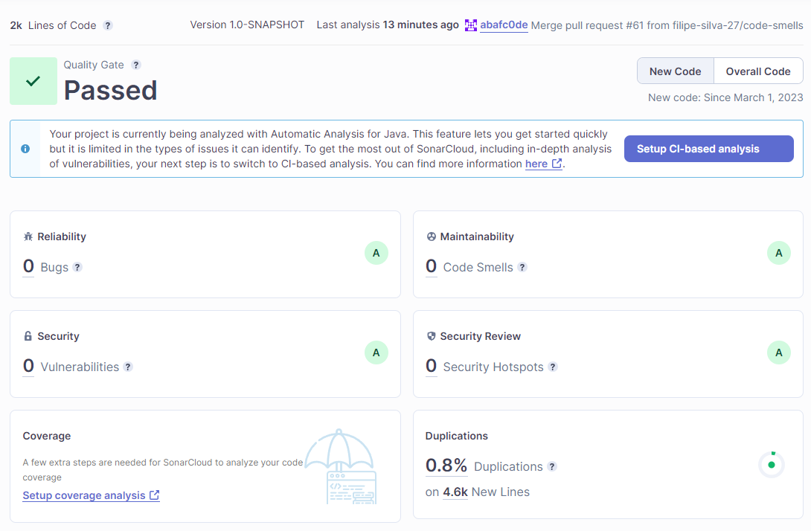
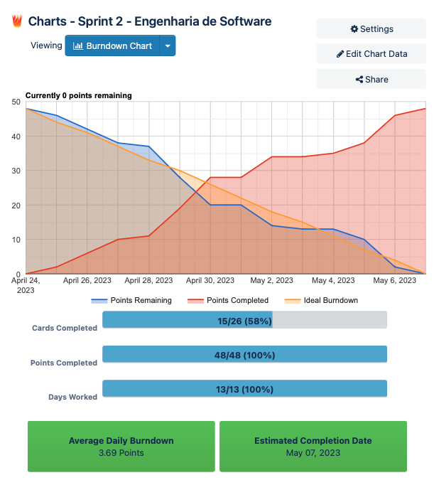

# Projeto da UC Engenharia de Software

## ES-2023-2Sem-Sexta-Feira-LIGE-GrupoA

#### Membros do grupo
| Nome            | Núm. Estudante | Username GitHub         |
|----------------|----------------|-------------------------|
| Filipe Silva    | 98979          | filipe-silva-27         |
| Francisco Torgo | 98634          | fmrva1                  |
| João Bastos     | 98957          | JotaBastos84            | 
| João Fouto      | 92913          | fouto0                  |
| Mário Cao       | 98384          | kreativermario          |
| Rui Duarte      | 94494          | Ruisth23                |

### Descrição do Projeto

- Este projeto consiste num programa de gestão de horários onde um utilizador pode:
  - Fazer o upload do seu horário (CSV ou JSON) e visualizá-lo.
  - Escolher o seu horário através das UC's e Turnos disponíveis.
  - Exportar o horário em CSV ou JSON.
  - E outras funcionalidades.

### Funcionalidades implementadas

- Import de ficheiro local csv ou json no formato aceitável com delimitador ";" 
- Import de ficheiro remoto (tem de ser um link de download direto, que não precisa de autenticação e que faça download assim que se entre no link) csv ou json 
  - Só são aceites horários csv no seguinte formato: 
  ```Curso;Unidade Curricular;Turno;Turma;Inscritos no turno;Dia da semana;Hora início da aula;Hora fim da aula;Data da aula;Sala atribuída à aula;Lotação da sala```
  - Só são aceites horários json no seguinte formato:
  ```
    [
    {
      "Curso": "CCG",
      "Unidade Curricular": "Relato Integrado no Sector Público e Privado",
      "Turno": "04279TP01",
      "Turma": "MCCGA1",
      "Inscritos no turno": 37,
      "Dia da semana": "Qua",
      "Hora início da aula": "14:30:00",
      "Hora fim da aula": "16:00:00",
      "Data da aula": "30/11/2022",
      "Sala atribuída à aula": "Auditório 4",
      "Lotação da sala": 250
    },
    {
      "Curso": "CCG",
      "Unidade Curricular": "Relato Integrado no Sector Público e Privado",
      "Turno": "04279TP01",
      "Turma": "MCCGA1",
      "Inscritos no turno": 37,
      "Dia da semana": "Qua",
      "Hora início da aula": "14:30:00",
      "Hora fim da aula": "16:00:00",
      "Data da aula": "23/11/2022",
      "Sala atribuída à aula": "Auditório 4",
      "Lotação da sala": 250
    },
    ]
    ```

- Conversão de horários com formato CSV para JSON
- Conversão de horários com formato JSON para CSV
- Exportação local do horário para formato CSV ou JSON
- Exportação remota (Gist) do horário para formato CSV ou JSON
- Criação de um horário através da escolha das Unidades Curriculares e Turnos.
- Visualização do horário em HTML (Diário, Semanal e Mensal) sendo as visualizações diárias, semanais com timetable
- Visualização de aulas sobrepostas
- Visualização de aulas sobrelotadas
- Carregamento de horário através de URI (Webcal)


### Instruções de utilização

- É necessário criar um ficheiro do tipo .env no root do projeto
- Dentro do ficheiro .env colocar o seu GitHub personal access token com permissão de gist:
```GITHUB_ACCESS_TOKEN=<github_personal_access_token>```
- Executar a App que está dentro da package gui
- Para a criação de um horário, deve ser dado um ficheiro horário com as Unidades Curriculares e as aulas desejadas de modo a que possa escolher

### Erros
- https://github.com/filipe-silva-27/ES-2023-2Sem-Sexta-Feira-LIGE-GrupoA/issues/49
- Na criação de um horário, quando se clica exportar remoto dá erro.

### Anexos
- Test Coverage de acordo com a métrica de Complexidade Ciclomática

- Sonarcloud 
- https://sonarcloud.io/project/overview?id=filipe-silva-27_ES-2023-2Sem-Sexta-Feira-LIGE-GrupoA 


- Burndown chart
